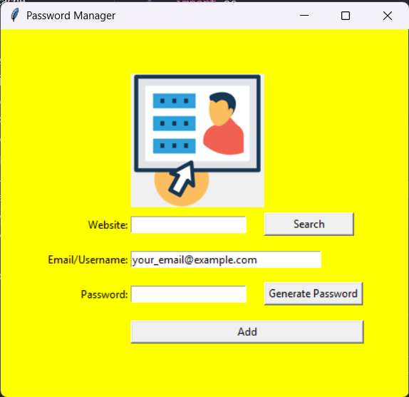
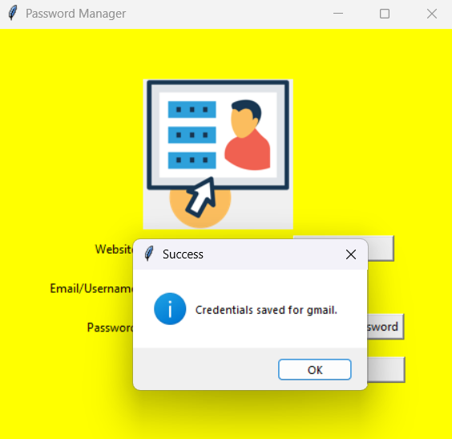
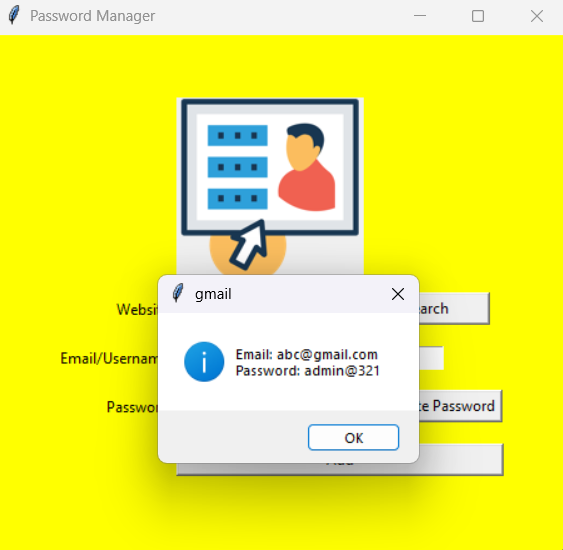
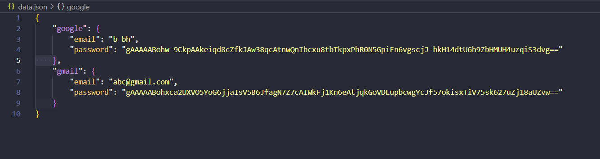

# 🔐 Password Manager GUI (Python)

[](https://www.python.org/)
[](https://docs.python.org/3/library/tkinter.html)
[](./LICENSE)

A modern and simple **Password Manager GUI App** built with **Python**, **Tkinter**, and **Fernet encryption**.  
Store your passwords securely offline — fully encrypted, open-source, and beginner-friendly.

---

## ✨ Features

- ✅ Securely store and encrypt passwords
- 🔑 AES-based symmetric encryption using `cryptography.Fernet`
- 🔍 Search saved credentials instantly
- 🎲 Generate strong random passwords
- 💾 Save data locally in an encrypted JSON file
- 🖼️ Modern GUI using Tkinter
- 🧊 Build into `.exe` using PyInstaller (included in guide)

---

## 📸 Screenshots

> *(Optional — include only if you upload screenshots to `/assets` folder in your repo)*


<br>

<br>

<br>

---

## 🚀 Getting Started

### 1. Clone the Repository
```
git clone [https://github.com/yourusername/password-manager.git](https://github.com/MrHorbio/Password-Manager.git)

cd password-manager

python main.py
```
